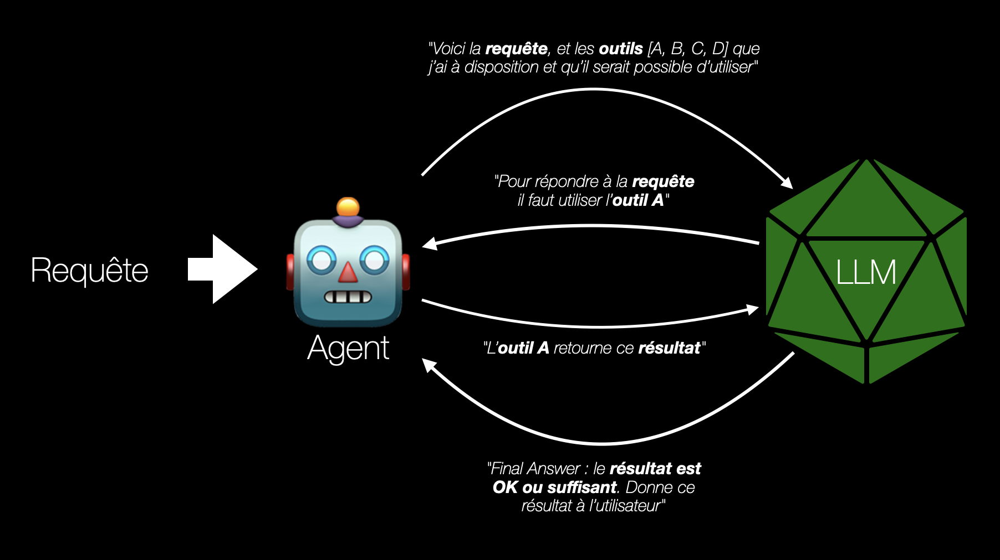

# Agents & Tools - LangChain

Les **Agents** dans LangChain ouvrent la voie à des systèmes plus dynamiques, capables de **raisonner étape par étape** et d'**interagir avec des outils** pour accomplir des tâches complexes.

Contrairement aux chaînes statiques (chains), **⚠️ un agent ne suit pas un chemin prédéfini**. **Il s'appuie sur un LLM** qui décide dynamiquement, à chaque étape, quelle action entreprendre : quel outil utiliser, quelles informations rechercher ou comment poursuivre, en fonction du contexte.

Les outils, ou **tools**, sont des fonctions encapsulées que l'agent peut appeler, il peut s'agir de fonctions pour interroger une base de données, de consulter une API, ou d'exécuter un calcul.

**Grâce à cette combinaison :**

> raisonnement du LLM → proposition d'action → exécution par l'agent → observation → nouveau raisonnement → et ainsi de suite...

... un agent LangChain devient un orchestrateur intelligent, capable de résoudre des problèmes ouverts ou de répondre à des requêtes complexes, sans suivre un script rigide.

L'agent suit un **schéma itératif** basé sur le pattern **ReAct (Reasoning + Acting)**.
À partir d'une requête, l'agent interagit avec un modèle de langage (LLM) qui raisonne étape par étape (**Thought**) et propose des actions (**Action**) à effectuer à l'aide d'outils disponibles.
L'agent exécute ces actions, collecte les résultats (**Observation**), et les renvoie au LLM pour affiner son raisonnement.
Ce cycle **ReAct** se répète jusqu'à ce que le LLM formule une réponse finale (**Final Answer**), que l'agent retourne à l'utilisateur.

## 1. Chargement du modèle LLM local

Dans cette section, nous chargeons un modèle de langage local grâce à **Ollama**. Cela permet de travailler avec un **LLM directement sur notre machine**, sans connexion à une API externe.

Nous utilisons ici la classe `ChatOllama` de **LangChain**, qui nous permet d'interagir facilement avec un modèle comme **llama3** déjà téléchargé via Ollama.

## 2. Agent standard

Un agent standard permet d'utiliser un modèle de langage avec un ou plusieurs **outils externes**, comme des fonctions Python, pour répondre à une tâche spécifique.
Cet agent **fonctionne sans mémoire** : il ne conserve **aucun historique des interactions précédentes**. Chaque question est traitée de manière indépendante, comme une **requête isolée**.

Dans cet exemple, l'agent utilise un outil simple pour répondre à la question « Quelle heure est-il ? », en appelant une fonction qui retourne l'heure actuelle.
Son comportement est guidé par un prompt ReAct standard chargé depuis LangChain Hub, qui lui permet de raisonner et de décider quand utiliser un outil.

### 2.1 Préparation des outils

### 2.2 Préparation et usage de l'agent

### 🧩 Exercices

> Exercice 1

Créez un agent capable de faire des conversions de température. Votre agent doit pouvoir répondre à des questions comme :
- *"Quelle est la température en Celsius pour 100 Fahrenheit ?"*
- *"Convertis 37.5 degrés Celsius en Fahrenheit."*

💡 Utilisez 2 **tools** différents

💪🏻 Bonus : Autoriser des entrées plus souples, comme "Convertis 100 F en C" ou "Celsius pour 212°F".

## 2. Agent conversationnel

Un agent conversationnel est conçu pour gérer un **dialogue continu**, en conservant une **mémoire des échanges précédents**. Contrairement à l'agent standard qui traite chaque requête indépendamment, un agent conversationnel **peut adapter ses réponses en fonction du contexte accumulé dans la conversation**.

Ce type d'agent est particulièrement utile pour construire des assistants interactifs, des conseillers ou des systèmes de FAQ qui doivent s'adapter aux intentions de l'utilisateur au fil du temps.

LangChain permet d'ajouter une mémoire à un agent grâce à des modules comme `ConversationBufferMemory`, afin que le modèle de langage puisse prendre en compte l'historique des échanges lors de chaque nouvelle interaction.

### 🧩 Exercices

> Exercice 1

Reprenez vos travaux sur l'exercice précédent pour y introduire un aspect conversationnel grâce à une boucle de conversation et à la gestion de la mémoire (`ConversationBufferMemory`).
